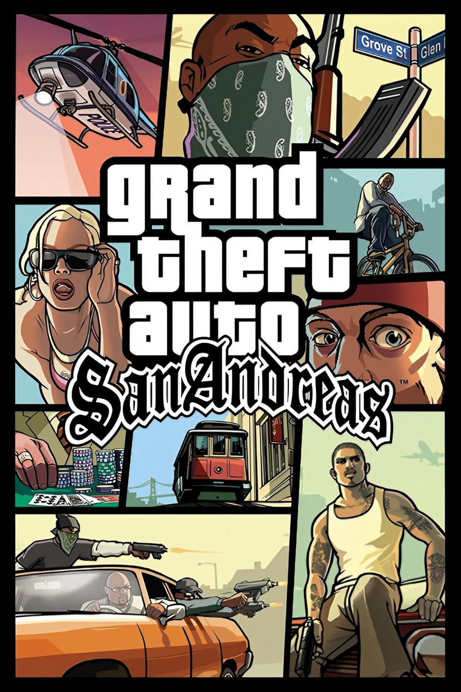
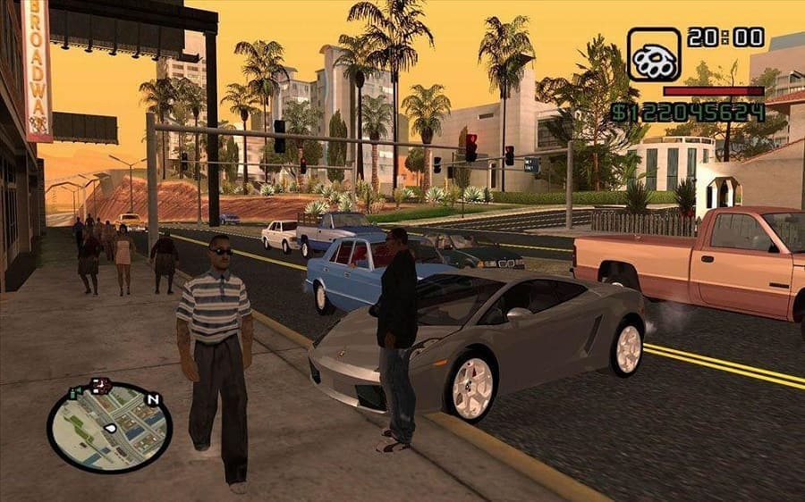
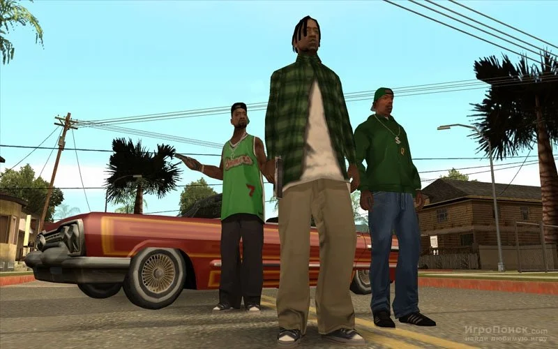
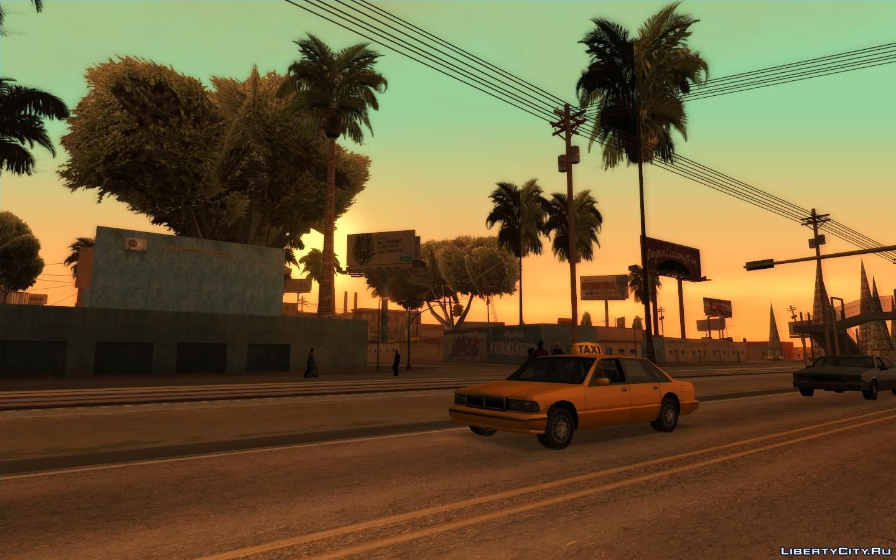

<html lang="ru">
<head>
    <meta charset="UTF-8">
    <meta name="viewport" content="width=device-width, initial-scale=1.0">
    <title>GTA San Andreas — Официальный сайт</title>
    
</head>
<body>
    <header>
        <h1>GTA San Andreas</h1>
        
Легендарная игра от Rockstar Games

    </header>
    <nav>
        <ul>
            <li><a href="#home">Главная</a></li>
            <li><a href="#about">Об игре</a></li>
            <li><a href="#cheats">Чит‑коды</a></li>
            <li><a href="#contacts">Контакты</a></li>
        </ul>
    </nav>
    <main>
        <section id="home">
            <h2>Добро пожаловать!</h2>
            
GTA San Andreas — это культовая игра в жанре action-adventure, выпущенная в 2004 году. Погрузитесь в мир криминала, свободы и приключений в вымышленном штате Сан-Андреас.

            
        </section>
        <section id="about">
            <h2>Об игре</h2>
            
<strong>Год выпуска:</strong> 2004

            
<strong>Разработчик:</strong> Rockstar North

            
<strong>Издатель:</strong> Rockstar Games

            
<strong>Платформы:</strong> PC, PlayStation 2, Xbox и др.

            
Сюжет игры разворачивается в 1990‑х годах. Главный герой — Карл «CJ» Джонсон — возвращается в Лос-Сантос после смерти матери и оказывается втянут в водоворот криминальных событий.

        </section>
        <section id="cheats">
            <h2>Популярные чит‑коды</h2>
            <ul>
                <li><strong>HESOYAM</strong> — полное здоровье, броня и $250 000</li>
                <li><strong>BAGUVIX</strong> — бесконечное здоровье (не защищает от взрывов)</li>
                <li><strong>ASNAEB</strong> — убрать уровень розыска (звёзды полиции)</li>
                <li><strong>LJSPQK</strong> — максимальный уровень розыска (6 звёзд)</li>
                <li><strong>RIPAZHA</strong> — летающие машины</li>
                <li><strong>XJVSNAJ</strong> — всегда полночь (00:00)</li>
            </ul>
            
<em>Внимание: использование чит‑кодов может заблокировать получение достижений.</em>

        </section>
      <h2>Скриншоты</h2>
      
      
        
    </main>
    <footer>
        
&copy; 2026 GTA San Andreas Fan Site. Все права защищены.Автор:Zer0code228

    </footer>
</body>
</html>
